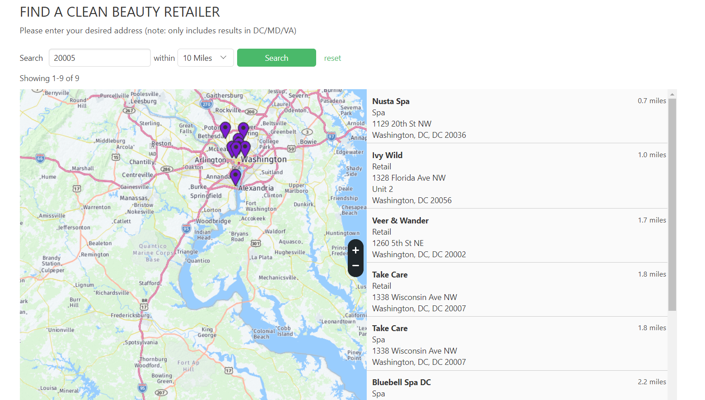

# Yelp-Database
Creates a Google Sheets database with information from the Yelp Fusion API. 
This Python script can be modified to find various businesses in locations all over the world using the Yelp Fusion API.

# Screenshots
Here is an example of some of the results found with the script!

